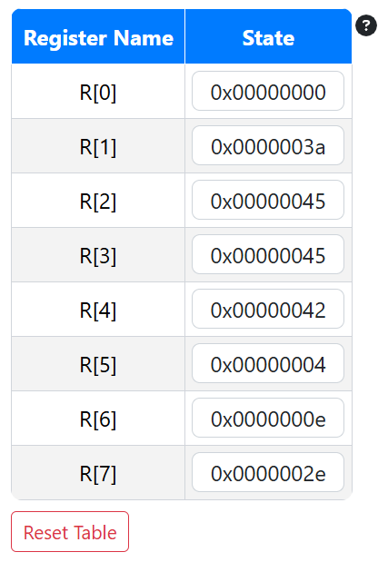
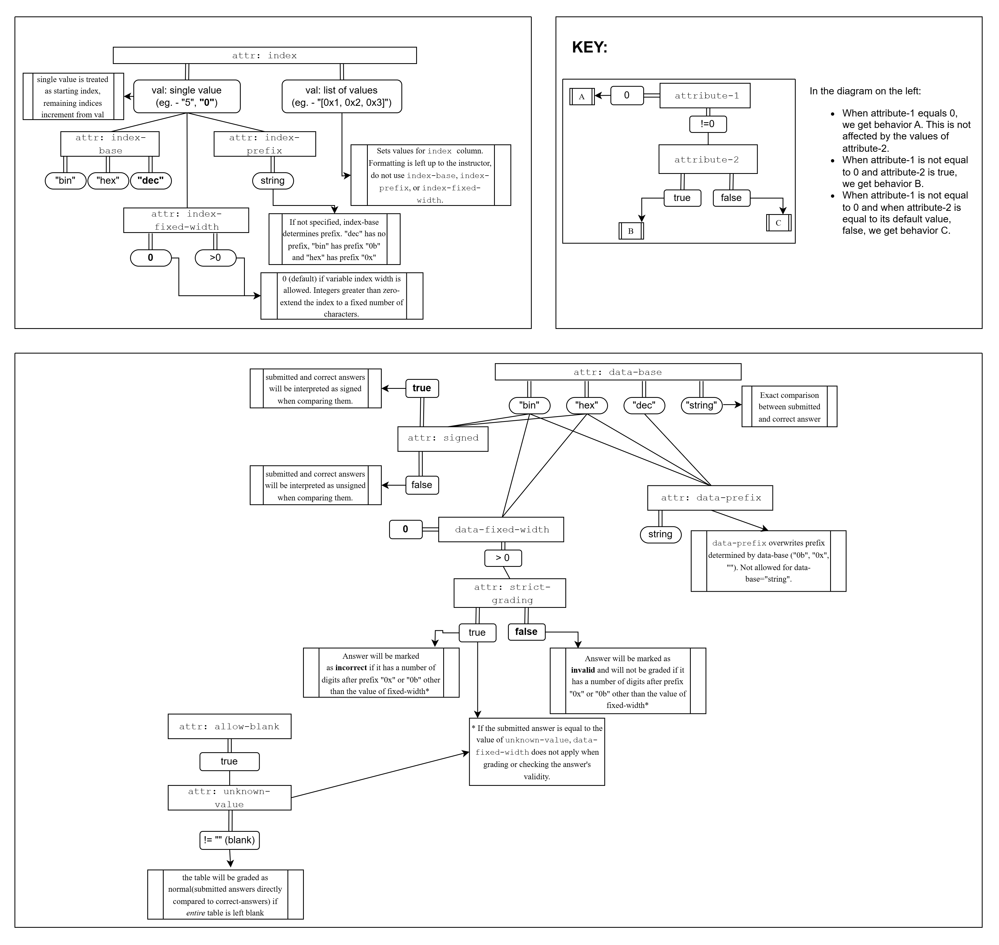

# PrairieLearn OER Element: Array Input

This element was developed by Kirthi Shankar, Maanvi Bonthu, and Shubhi Bhatia, under the mentorship of Nico Ritschel and Geoffrey Herman.

If you like this element, you can use it in your own PrairieLearn course by copying the contents of the `elements` folder into your own course repository. After syncing, the element can be used as illustrated by the example question that is also contained in this repository.

## `pl-array-input` element

This element creates an array table and can be used for both instructional materials and questions. The first column is intended to store the indices of an array. The second column is supplied as an attribute (either to be displayed or to be used for grading student inputs). 

This element is primarily designed for low-level computer architecture courses, but has lots of customization options that should cover many other use cases (e.g., array contents in a programming or data structure course). The long list of attributes below can be intimidating, but almost no use case should require setting all of them. We have provided a dependency chart at the bottom to make it easier to see how attributes affect each other. We also recommend looking through the many example questions we have created to illustrate the attributes and use cases for the element.

### Example



```html
<pl-array-input
  answers-name="q2"
  index="[R[0], R[1], R[2], R[3], R[4], R[5], R[6], R[7]]"
  correct-answer="[0x00000000, 0x0000003a, 0x00000000, 0x00000045, 0x00000042, 0x00000000, 0x0000000e, 0x0000002e]"
  column-names="[Register Name, State]"
  prefill="[0x00000000, 0x0000003a, 0x00000045, 0x00000045, 0x00000042, 0x00000004, 0x0000000e, 0x0000002e]"
  show-partial-score="false"
  data-base="hex"
></pl-array-input>
```

### Element Attributes

| Attribute            | Type                                | Description                                                                                                                                                                                                                                                                                                                                                                                                                                                                                    |
| -------------------- | ----------------------------------- | ---------------------------------------------------------------------------------------------------------------------------------------------------------------------------------------------------------------------------------------------------------------------------------------------------------------------------------------------------------------------------------------------------------------------------------------------------------------------------------------------- |
| `answers-name`       | string (required)                   | Unique name for the element. |
| `weight`             | integer (default: `1`)              | Weight of element's score in the question it is a part of. |
| `is-material`        | boolean (default: `false`)          | If set to `true`, the table is static, to be used as instructor-provided material. The correct answers are displayed to students instead of being used for grading. |
| `column-names`       | string (default: `"[Index, Data]"`) | Names of the column headers. Should be listed in the style of an array (in square brackets and comma-separated, `"[Column 1, Column 2]"`). Supports HTML formatting. Reserved HTML characters such as `<`, `>` and `"` should be HTML escaped (e.g., `&quot;`). |
| `index`              | string (default: `"0"`)             | The index values (for example, addresses or registers), displayed under the first column. Should be listed in the style of an array (in square brackets and comma-separated, `"[0x123, 0x124, 0x131, 0x132]"`), or as a single value representing the start address (`"[5]"` or `"5"`). If only a single value is given, the number of rows is determined by the number of correct answers, and the remaining indices are an integer sequence ascending from the start address. |
| `index-base`         | string (default: `"dec"`)           | The displayed base of the index values, only used when generating `index` values from a single start address. Allowed options are `dec`, `hex`, and `bin`.     
| `index-prefix`       | string (default: `None`)            | A displayed prefix for each index value, only used when generating `index` values from a single start address. By default, an appropriate prefix (e.g., `0x` or `0b`) is determined based on `index-base`. To remove the prefix, this parameter can be set to `""`.   
| `index-fixed-width`  | integer (default: `0`)              | Zero-extends the index values to ensure a fixed width, only used when generating `index` values from a single start address. The value must be greater than the width of the largest index. If set to `0`, indices will not be zero-extended. | 
| `correct-answer`     | string (required if not set in `server.py`) | Correct values that should be inputted into the table. Displayed to students when `is-material=true`, and used for grading otherwise. This value can either be set in this attribute, or in a separate server.py file. Should be listed in the style of an array (in square brackets and comma-separated, e.g., `"[0x40, 0x2d, 0x00, NA]"`). |
| `placeholder`        | string (default: None)              | Placeholder values displayed for blank input boxes. Can be listed in the style of an array (in square brackets and comma-separated, e.g., `"[0x40, 0x2d, 0x00, NA]"`) or as a single value to be used for all cells (`"NA"`). |
| `prefill`            | string (default: `None`)            | Prefilled values for all input boxes that can be directly edited (especially useful for large tables where sparse edits should be made). Should be listed in the style of an array (in square brackets and comma-separated, `"[0x40, 0x2d, 0x00, NA]"`) or as a single value to be used for all cells (`"0x00"`). |
| `data-base`          | string (default: `"dec"`)           | Base of the answer values entered by or displayed to the student. This will be used to parse and format answers. Options are `dec`, `hex`, `bin`, and `string`. If set to `string`, submitted answers are required to match the correct answer exactly (case sensitive), and none of the remaining data-related attributes apply.  |
| `unknown-value`      | string (default: `""`)              | A non-numeric unknown value (e.g., `"NA"`) that is allowed to be entered, ignoring `data-base`. |
| `data-prefix`        | string (default: `None`)            | A displayed prefix for each answer value that is displayed, or for prefill and placeholder values if applicable. Does not apply if `data-base` is set to `string`. By default, an appropriate prefix (e.g., `0x` or `0b`) is determined based on `index-base`. To remove the prefix, this parameter can be set to `""`.  |
| `data-fixed-width`   | integer (default: `0`)              | If set to 0, submitted answers will be parsed and graded as numbers and padding will be ignored. For example, `0x26` and `0x0026` will be considered as the same value. If set to a value greater than `0`, answers must be padded to match exactly the specified width (unless they are equal to `unknown-value`). |
| `strict-grading`     | boolean (default: `false`)          | Only applies if `data-fixed-width` is greater than `0`. If `strict-grading` is false and the answer does not match the expected width, the answer will be marked as invalid and not graded. If set to `true`, the answer will be graded as incorrect. |
| `signed`             | boolean (default: `true`)           | Used only for grading if `data-base` is set to `hex` or `bin`. If set to `true`, the submitted answer and correct answer are treated and compared as signed values. Otherwise, they are treated as unsigned values. |
| `show-partial-score` | boolean (default: `true`)           | Shows students fine-grained row-by-row grading feedback via a badge next to the each row. |
| `hide-help-text`     | boolean (default: `false`)          | Hides the help button next to the table that explains the expected format and grading scheme. |
| `partial-credit`     | boolean (default: `true`)           | If set to `true`, student scores are determined based on the percentage of correct rows. If set to `false`, all-or-nothing grading is used. |
| `size`               | integer (default: `0`)             | Specifies a fixed character width for all input boxes in the second column. This is purely a cosmetic setting, unlike `data-fixed-width`. If set to `0`, the input boxes are sized based on the length of the correct answers, prefills, and placeholders. To reveal less information about the expected answer length, this attribute allows a fixed size to be set for all boxes. |
| `allow-blank`        | boolean (default: `false`)          | If set to true, all values in the table can be left blank (even if `unknown-value` is not `""`). A blank submission will be graded rather than marked as invalid, which might be necessary for some custom grading setups (e.g., where students pick between multiple tables to fill out). | 

### Attribute Dependency Diagram


